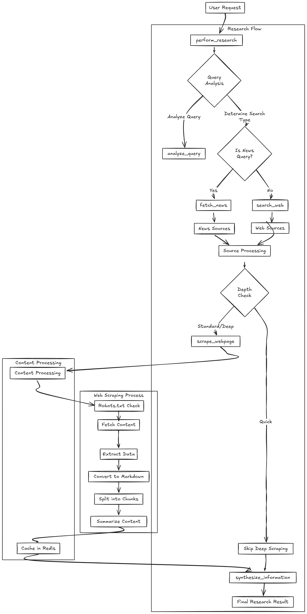
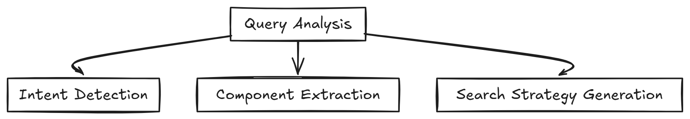
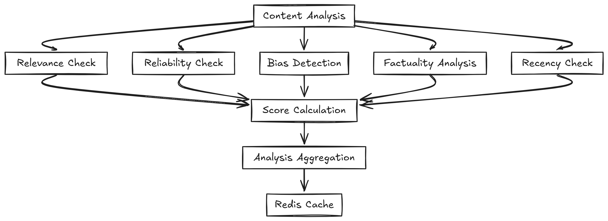
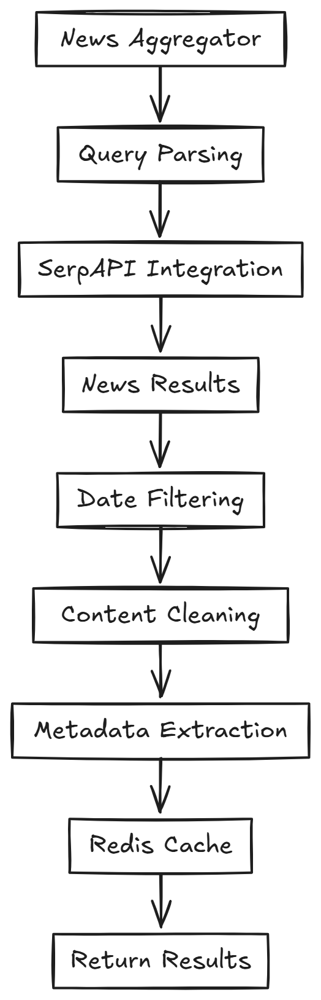

# Web Research Agent Design Document

## 1. Overview

The Web Research Agent is an AI-powered system designed to perform comprehensive web research on behalf of users. It can search the web, extract relevant information from websites, analyze content, and synthesize findings into coherent, useful responses.

## 2. Agent Architecture

### 2.1 System Architecture Diagram

### 2.2 Decision Flow Process

1. **Query Analysis**: The agent first analyzes the user query to determine:
   - Research intent (factual information, opinion, news, etc.)
   - Key components of the query
   - Appropriate search strategy
   - Required information types
   

2. **Search Strategy Selection**: The system analyzes queries and selects the best search approach based on intent and relevance:
   - Performs intent-based query analysis to choose between factual, temporal, or analytical search styles.
   - Extracts and evaluates 3 candidate queries per user prompt using LLM and regex parsing.
   - Scores candidate queries using a BM25-like ranking mechanism, prioritizing recency, phrasing, and term overlap.
   - Selects the top-scoring query as the final optimized search query for execution.

3. **Information Gathering**: The agent executes the search strategy and collects information from multiple sources.

4. **Content Processing**: Raw content is processed to:
   - Extract relevant information
   - Analyze reliability and relevance
   - Identify contradictions or gaps
   - Summarize key points

5. **Information Synthesis**: The agent combines information from all sources to:
   - Resolve contradictions
   - Organize information logically
   - Generate a comprehensive answer
   - Cite sources appropriately

6. **Response Generation**: A final response is prepared that directly addresses the user's query.

### 2.3 Error Handling

The agent employs robust error handling at each stage:

- **Unreachable Websites**: If a website is unreachable, the agent logs the error, continues with available sources, and notes the limitation in the final response.
- **[TODO]** **Rate Limiting**: Implement exponential backoff and rotates user agents to handle rate limiting.
- **Parsing Failures**: If content extraction fails, the agent falls back to snippets provided by search APIs.
- **Contradictory Information**: The agent identifies contradictions, evaluates source reliability, and presents the most credible information with appropriate caveats.
- **Timeout Handling**: All web operations have configurable timeouts with appropriate fallback mechanisms.

## 3. Tool Integration

### 3.1 Web Search Tool

**Input**: User query, search parameters (depth, result limit)  
**Output**: Search results with URLs, titles, and snippets  
**Implementation**: Uses the Serper API to perform Google searches with configurable parameters.  

### 3.2 Web Scraper/Crawler

**Input**: URL, optional selectors for targeted extraction  
**Output**: Structured content including main text, headings, tables, and links  
**Implementation**: 
- Basic scraper uses BeautifulSoup for HTML parsing
**[TODO]**- Advanced scraper uses Pyppeteer (Puppeteer Python port) for JavaScript-rendered content [Browser Failing Unexpcetdly]
- Content is converted to markdown for consistent processing

**Decision Making**: Determines content relevance and extracts key information based on structural elements and semantic context.

### 3.3 Content Analyzer

**Input**: Extracted content, analysis criteria  
**Output**: Content analysis with scores and explanations for relevance, reliability, bias, factuality, and recency  
**Implementation**: Uses LLM (GPT-4o-mini) to evaluate content based on predefined criteria.  
**Decision Making**: Analysis results inform source prioritization and synthesis, with higher-scoring content given more weight.

### 3.4 News Aggregator

**Input**: News-related query, time range, result limit  
**Output**: Recent news articles with source, date, title, and snippet  
**Implementation**: Uses specialized search queries and filters to focus on news sources.  
**Decision Making**: News is prioritized by recency and relevance, with particular attention to source credibility.

## 4. Core Agent Capabilities

### 4.1 Query Analysis

The agent analyzes queries to:
- Identify research intent (factual, exploratory, news, etc.)
- Break down complex questions into components
- Detect time sensitivity (recent vs. historical information)

Implementation: Uses LLM with specialized prompting to extract query characteristics and formulate research strategy.

### 4.2 Web Search

The agent formulates effective search strategies by:
- Generating appropriate search terms from the query
- Applying domain-specific modifiers when relevant
- Adapting search terms based on initial results
- Filtering results by relevance and credibility

Implementation: Combines API-based search with intelligent query refinement.

### 4.3 Content Extraction

The agent extracts information from websites by:
- Identifying and parsing key structural elements (headings, paragraphs, tables)
- Distinguishing between primary content and navigation/ads
- Handling different content types appropriately
- Respecting robots.txt and implementing rate limiting

Implementation: Uses multiple extraction techniques (BeautifulSoup for basic HTML, Pyppeteer for JavaScript-rendered content).

### 4.4 Information Synthesis

The agent synthesizes information by:
- Combining data from multiple sources
- Resolving contradictions based on source reliability
- Organizing information in a logical structure
- Generating concise summaries that address the original query
- Citing sources appropriately

Implementation: Uses advanced LLM capabilities to process and synthesize multiple sources.

## 5. Technical Implementation

### 5.1 Core Technologies

- **Python**: Primary programming language
- **OpenAI GPT-4o/GPT-4o-mini**: For natural language understanding and generation
- **BeautifulSoup**: For HTML parsing
- **Pyppeteer**: For JavaScript-rendered content
- **Asyncio**: For efficient concurrent operations
- **Redis**: For caching search results and extracted content

### 5.2 Key Features

- **Asynchronous Processing**: All web operations are asynchronous for improved performance
- **Caching System**: Results are cached to reduce redundant operations and API calls
- **Modular Design**: Components can be used independently or as part of the full pipeline
- **Configurable Research Depth**: Users can specify quick, standard, or deep research modes
- **Error Resilience**: Robust error handling and fallback mechanisms
- **Source Attribution**: All information is properly attributed to its source

### 5.3 Security and Ethical Considerations

- **Rate Limiting**: Implements respectful crawling practices
- **User Agent Rotation**: Prevents IP blocking
- **Robots.txt Compliance**: Respects website crawling policies
- **Content Attribution**: Properly attributes information to sources
- **Privacy Consciousness**: Does not store unnecessary user data

## 6. Testing Strategy

- **Unit Tests**: Individual components tested in isolation
- **Integration Tests**: Tests for interactions between components
- **End-to-End Tests**: Complete research flows with various query types
- **Error Case Testing**: Tests for handling of various error conditions
- **Performance Testing**: Metrics for response time and resource usage

## 7. Future Improvements

- Enhanced multi-language support
- Integration with academic search APIs
- Image and video content analysis
- Improved fact-checking capabilities
- User feedback incorporation for continuous improvement
- Expandable plugin system for additional data sources